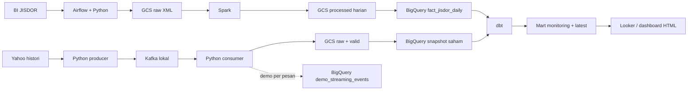

# Financial Market & IDR Exposure Monitoring

Final Project Data Engineering ? Purwadhika JCDEAH-009 ? Daud Fernando.

Pipeline menggabungkan harga saham finansial dalam USD dengan kurs BI JISDOR untuk memantau nilai indikatif rupiah, membandingkan return, dan menjelaskan sinyal simulasi. Pengguna yang dibayangkan adalah analis treasury/market risk; tidak ada klaim kepemilikan institusi atau penghematan bisnis yang sudah diukur.

## Dokumentasi

- [Diagram Bronze, Silver, Gold](docs/bronze_silver_gold.svg)
- [Penjelasan model dan grain data](docs/medallion_bronze_silver_gold.md)
- [Pipeline batch BigQuery](docs/bigquery_batch.md)
- [Transformasi dan mart analitik](docs/demo_analytics.md)
- [Rumus sinyal dan kolom dashboard](docs/stock_signals.md)

## Status terverifikasi ? 19 September 2026

| Bagian | Hasil |
|---|---|
| Batch JISDOR | 30 tanggal, 6 Agustus?18 September 2026 |
| Snapshot saham | 7.797 bar JPM/BAC/GS/MS, sesi 14?18 September 2026 |
| Model dan tests | 8 view dbt; 21 data tests + 3 unit tests lulus |
| Rekonsiliasi snapshot | Missing/mismatch/duplikasi 0; pasangan FX kosong 0 |
| Streaming per pesan | Kafka ? Python ? raw GCS ? streaming insert BigQuery; read-back diuji |
| Alert | Email pengujian di Mailpit lokal |
| Dashboard | HTML lokal siap; sumber mart BigQuery siap untuk Looker |

Data sumber historis asli; pengiriman saham adalah replay. Sinyal SMA3/SMA8 merupakan simulasi aturan, belum hasil backtest keuntungan. Quantity selalu satu saham. Snapshot setelah refresh dapat berbeda dari angka ini.

URL report Looker Studio belum diberikan. Repository ini tidak mengklaim report Looker telah selesai atau dibagikan.

## Alur dan teknologi



Airflow menjadwalkan batch; Spark menstandarkan kurs; Kafka menyimpan event/offset; Python memvalidasi event; GCS menyimpan bukti; BigQuery menyimpan data; dbt membangun model dan tests. Docker/Compose menjalankan layanan lokal, PostgreSQL menyimpan metadata Airflow. Dataflow/PubSub tidak dipakai pada jalur final.

Dua mode replay berbeda:

- `run_demo.cmd`: snapshot lengkap dimuat dari GCS setelah replay selesai, lalu dbt dan ekspor dashboard.
- `run_streaming_demo.cmd`: pesan dimasukkan ke tabel demo terpisah satu per satu; tidak otomatis memperbarui mart/chart utama.

Medallion merupakan pemetaan logis, bukan star schema lengkap atau tiga dataset fisik baru.

## Menjalankan di Windows PowerShell

Prasyarat: Docker Desktop (Linux containers), Python/environment sesuai requirements, Google Cloud CLI, user ADC yang memiliki akses ke resource proyek. Kode cloud dikonfigurasi untuk `jcdeah-009`, bucket `jcdeah-009-daud-finalproject`, region `asia-southeast2`; pengguna lain perlu akses atau menyesuaikan konfigurasi/referensi proyek. Repository ini tidak memberikan akses GCP publik.

```powershell
python -m venv .venv
.\.venv\Scripts\python.exe -m pip install -r requirements.txt
gcloud auth application-default login
.\.venv\Scripts\python.exe scripts\prepare_airflow.py
.\.venv\Scripts\python.exe scripts\compose.py build airflow
docker compose --env-file .env.airflow -f compose.yaml -f compose.streaming.yaml -f compose.analytics.yaml --profile streaming --profile analytics build market dbt
.\prepare_demo.cmd
```

`prepare_demo.cmd` mengambil histori baru, membuat arsip/kandidat aktif, menjalankan DAG batch dengan audit tanggal, lalu replay lengkap sampai mart/dashboard. Fresh clone tidak berisi data sumber: unduhan diperlukan. Docker/image build hanya diperlukan pada setup awal/perubahan dependencies.

Memperbarui data dan membuka dokumentasi model:

```powershell
.\prepare_demo.cmd
.\dbt_docs.cmd
```

Menjalankan replay per pesan:

```powershell
.\run_streaming_demo.cmd --limit 40 --interval 2
# PowerShell kedua setelah minimal tiga pesan terkirim:
.\show_kafka.cmd
```

Batch: buka Airflow, DAG `jisdor_daily`, Trigger DAG atau tunggu jadwal 18:00 WIB saat layanan hidup. Enam task: collect ? upload_raw ? transform_spark ? upload ? warehouse ? check_dates. MERGE memakai tanggal + mata uang. Cakupan pengambilan 45 hari; gap lebih lama memerlukan backfill terpisah.

## Akses layanan

- Airflow lokal: http://localhost:8085
- dbt Docs lokal: http://localhost:8086 (`.\dbt_docs.cmd`)
- Mailpit lokal: http://localhost:8025
- [BigQuery editor](https://console.cloud.google.com/bigquery?project=jcdeah-009)
- [Mart monitoring](https://console.cloud.google.com/bigquery?project=jcdeah-009&p=jcdeah-009&d=daud_finalproject_demo&t=mart_stock_monitoring&page=table)
- [Mart latest](https://console.cloud.google.com/bigquery?project=jcdeah-009&p=jcdeah-009&d=daud_finalproject_demo&t=mart_stock_latest&page=table)
- [Streaming per pesan](https://console.cloud.google.com/bigquery?project=jcdeah-009&p=jcdeah-009&d=daud_finalproject_demo&t=demo_streaming_events&page=table)
- [Audit tanggal JISDOR](https://console.cloud.google.com/bigquery?project=jcdeah-009&p=jcdeah-009&d=daud_finalproject&t=jisdor_date_coverage&page=table)

Link localhost membutuhkan layanan pada laptop sendiri; link GCP membutuhkan izin. Password Airflow dibuat lokal oleh setup dan tidak dipublikasikan.

## Struktur repository

| Folder | Isi |
|---|---|
| airflow | DAG dan image Airflow/Spark |
| streaming | Producer, consumer, demo per pesan |
| scripts | Collection, validasi, publication, refresh, dokumentasi |
| analytics | dbt models, sources, macro dan tests |
| sql | MERGE batch |
| dashboard | HTML/JS/CSS; data hasil ekspor dibuat lokal |
| docs | Dokumentasi pipeline, diagram, model dan validasi data |
| tests | Pengujian offline/integrasi komponen |
| deployment | Eksperimen Dataflow lama; bukan jalur final |

## Data dan batas reproduksi

Credential, `.env.airflow`, password, logs, folder data, ekspor Excel/data dashboard dan config replay runtime tidak diunggah. Snapshot diunduh/dibuat ulang oleh pipeline; tanggal sumber mengikuti ketersediaan Yahoo/BI. Histori minute tidak dijamin tersedia tanpa batas, sehingga data pada tanggal tertentu belum tentu bisa diunduh lagi kemudian.

Data harga tidak diubah untuk membuat sinyal seimbang. Gap tidak diimputasi; NO_SIGNAL/null dapat menjadi hasil yang benar. Umur FX dan kebijakan join disertakan. InsertId BigQuery bersifat best effort; view demo melakukan deduplikasi per run/event, bukan klaim exactly-once lintas sink.

Publikasi kode tidak memindahkan hak atas data pihak ketiga.

## Sumber

- [Web service BI JISDOR](https://www.bi.go.id/biwebservice/wskursbi.asmx?op=getSubKursJisdor3)
- [Yahoo Finance JPM](https://finance.yahoo.com/quote/JPM/)
- [Dokumentasi yfinance](https://ranaroussi.github.io/yfinance/)
- Guideline lokal Final Project JCDEAH-009: memperbolehkan replay bila sumber streaming tidak tersedia; dokumen bootcamp tidak direpublikasikan.
