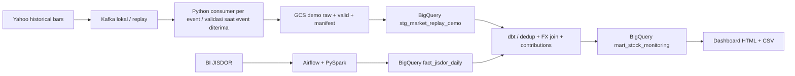

# Menjalankan demo sampai dashboard

Versi demo dapat dijalankan sekarang memakai data historis asli JPM, BAC, GS, dan MS. Jalurnya:



## Buka hasil yang sudah siap

Buka `dashboard/index.html` dengan browser. Snapshot memiliki dua grafik interaktif, filter sesi pasar, empat metrik, dekomposisi nilai, dan tabel provenance. Tidak membutuhkan server atau koneksi internet untuk melihat snapshot yang telah diekspor. Unduh CSV dari dashboard untuk pemeriksaan tambahan.

Dataset demo terpisah: `jcdeah-009.daud_finalproject_demo`. Input market khusus demo adalah `jcdeah-009.daud_finalproject.stg_market_replay_demo`. Tabel cloud `stg_market_events` tidak diisi melalui shortcut demo ini.

## Command CMD

Dengan Docker Desktop aktif dan user ADC masih valid:

```bat
cd /d "C:\Purwadhika\Final Project"
run_demo.cmd --build
```

Command membuat topic Kafka unik, mengirim 7.788 bar historis yang sudah tersedia, menjalankan consumer Kafka + Python, mengunggah hasil ke GCS, mengganti snapshot tabel **demo**, menjalankan dbt build beserta tests, lalu mengekspor dashboard. Jika sebuah langkah gagal, langkah berikutnya tidak dilanjutkan. Script membutuhkan akses GCS dan BigQuery yang sudah digunakan proyek; tidak membuat VM atau Dataflow job.

Untuk memakai capture yang sudah lolos tanpa mengirim ulang Kafka:

```bat
run_demo.cmd --source-run-id 20260917T123103782750Z
```

Tabel demo menggunakan WRITE_TRUNCATE agar rerun tidak menumpuk snapshot. Raw GCS tetap immutable; objek berbeda dengan nama sama ditolak. Ini tidak menghapus atau mengganti tabel streaming cloud.

## Hasil terverifikasi

Snapshot terbaru: 7.788 bar, empat saham, lima sesi 10 sampai 16 September 2026. Rekonsiliasi Kafka/Python/BigQuery cocok seluruhnya; FX kosong nol. Delapan view, 21 data tests, dan tiga unit tests lulus. Ada 103 observasi review_movement, bukan ukuran akurasi deteksi.

Detail rumus, distribusi sinyal, tabel Looker Studio, dan bukti: [stock_signals.md](stock_signals.md).

## Aturan dan keterbatasan analitik

1. Satu baris mart adalah satu simbol, mode, tipe observasi, dan menit. Live price updates dan replay bar historis tidak digabung menjadi satu seri.
2. Deduplikasi memakai event ID sumber yang stabil. Jika ada beberapa observasi per menit, model memilih observasi terakhir dengan urutan deterministik.
3. `fx_available_at` yang terverifikasi harus <= waktu event. Jika null, hanya kurs bertanggal **sebelum tanggal event WIB** yang dipakai. Ini asumsi konservatif, bukan bukti waktu publikasi historis; revisi historis sumber masih mungkin terjadi.
4. Quantity selalu satu saham. Tidak ada klaim posisi, laba terealisasi, kerugian institusi, atau ROI operasional.
5. Kontribusi pada mart memakai pasangan menit berurutan dalam sesi yang sama. Gap dan overnight menghasilkan null. Kontribusi dashboard membandingkan awal-akhir pilihan dan dapat mencakup overnight; label grafik menjelaskan pembandingnya.
6. Baseline z-score memakai return pada 30 menit sebelumnya, tanpa observasi saat ini, minimal 20 return; baseline dipisahkan per sesi. Ambang 3 belum dikalibrasi. Corporate action/stock split belum dinormalisasi untuk analisis jangka panjang.
7. Dashboard adalah snapshot ekspor, bukan live refresh. Perbarui melalui command demo. Grafik memakai urutan observasi; jarak waktu antar-sesi tidak ditampilkan secara proporsional.

## Model dbt

| Model | Fungsi |
|---|---|
| stg_prices | Deduplikasi source event |
| int_market_minutes | Memilih harga per menit dan tanggal sesi |
| fact_market_exposure | Join FX konservatif, umur FX, valuasi per saham |
| mart_market_risk | Return, kontribusi harga/FX/interaksi, baseline historis, indikator demo |
| int_stock_features | SMA3/SMA8 dan return sesi tanpa harga masa depan |
| mart_stock_monitoring | Sinyal simulasi dan perbandingan empat saham |
| mart_stock_latest | Bar sumber terbaru tiap saham |
| demo_signal_scenarios | Lima skenario sintetis terpisah untuk pengujian rumus |

Source input dikonfigurasi dengan `market_table`. Target default `demo` menggunakan dataset demo; ketika cloud streaming siap, gunakan target `cloud` dengan source default `stg_market_events`. Test `market_not_empty` sengaja gagal ketika input kosong sehingga build kosong tidak disebut berhasil. Tidak ada paket dbt eksternal.

## Looker Studio dan kebutuhan eksternal

Dashboard HTML sudah tersedia untuk demo. **Report Looker Studio belum dibuat.** Untuk menghubungkan Looker Studio, pilih konektor BigQuery, project `jcdeah-009`, dataset `daud_finalproject_demo`, view `mart_stock_monitoring` (atau `mart_stock_latest` untuk tabel status terakhir):

- Time series 1: dimension `minute_utc`, metric `exposure_idr`, filter satu symbol/mode.
- Time series 2: dimension `minute_utc`, metric `usd_idr`.
- Table: `session_date`, `symbol`, `risk_indicator`, `baseline_count`, `fx_age_calendar_days`.
- Gunakan AVG atau MAX pada grain satu symbol/menit, bukan SUM harga. Selalu tampilkan mode replay, quantity=1, dan tanggal snapshot.

Report harus diuji dan dibagikan melalui akun pengguna; URL report belum tersedia.
