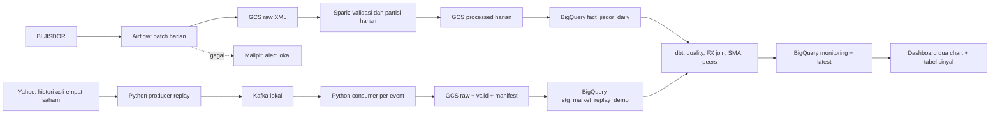

# Audit guideline dan data siap dashboard

Diperiksa 17 September 2026 terhadap dokumen lokal **Guideline & Standar Penilaian Final Project - JCDEAH-009.docx**. Dokumen adalah acuan penilaian, bukan perintah untuk menjalankan semua teknologi yang disebutkan.

Guideline menuliskan teknologi yang **bisa dipakai**. Batch memilih Spark, streaming memilih Kafka, transformasi memilih dbt/Python. Tidak perlu memakai Spark dan Dataflow sekaligus, atau Kafka dan Pub/Sub sekaligus. Catatan sumber: “Apabila data streaming tidak ditemukan, bisa menggunakan data dummy atau replay sebagian data dari dataset”. Dataset khusus sudah disetujui menurut konfirmasi pengguna.

## Arsitektur final yang berjalan



Consumer berjalan sebelum producer dan memvalidasi event ketika diterima. Replay sengaja dibatasi 7.788 pesan dengan interval kirim 0,005 detik. Setelah replay lengkap dan valid, hasil dipublikasikan ke GCS dan BigQuery dengan load job. **Penerimaan Kafka diproses per event; pembaruan warehouse/dashboard dilakukan setelah replay selesai**, bukan refresh warehouse setiap tick. Tidak mengklaim harga live, operasi 24/7, atau exactly-once lintas sink.

Kafka lokal berhasil, jadi tidak diganti. Dataflow dikeluarkan dari jalur utama dan tidak menjadi prasyarat. Kode eksperimen Beam/Dataflow lama tetap tersedia sebagai arsip opsional. API Consumer merujuk [dokumentasi resmi Confluent](https://docs.confluent.io/platform/7.7/clients/confluent-kafka-python/html/index.html).

## Pemetaan kebutuhan dan bukti

| Kebutuhan guideline | Implementasi dan status |
|---|---|
| Problem bisnis dan dataset | README: monitoring harga USD, nilai IDR, kontribusi FX; JISDOR + JPM/BAC/GS/MS |
| Sumber masuk datalake | GCS raw JISDOR; replay raw, valid, manifest dengan checksum |
| File bulanan menjadi harian | JISDOR hasil rentang tanggal dipisah per tanggal di GCS; harga sumber bar menit, bukan file bulanan |
| Datalake ke warehouse | Spark untuk batch, load dari GCS ke BigQuery; replay juga load GCS ke BigQuery |
| Batch terjadwal | DAG jisdor_daily 18:00 WIB, retry 2; run scheduled 17 September sukses |
| Streaming/replay | Kafka + Python berjalan bersamaan; 7.788 diterima/valid, invalid 0 |
| Transformasi warehouse | Delapan view dbt; sinyal SMA3/SMA8, perbandingan empat saham, FX join konservatif |
| Data quality | 21 data tests + 3 unit tests dbt lulus; rekonsiliasi 7.788 identik tanpa missing/mismatch/duplikasi |
| Alert pipeline gagal | Callback Airflow ke Mailpit; wrapper replay juga memakai callback lokal; delivery diuji |
| Dashboard minimal 2 chart | dashboard/index.html: nilai IDR, kurs; filter saham/sesi, sinyal, perbandingan, CSV |
| Docker/Compose | Airflow, PostgreSQL metadata, Mailpit, Kafka, Python market, dbt |
| Arsitektur/dokumentasi/model | Dokumen ini, README, docs/stock_signals.md, model SQL dbt dan runbook |
| Berkas slide | docs/final_project_checkpoint.pptx; draft lima slide berdasarkan angka audit |
| Link GitHub | **Belum dipublikasikan**; belum ada repository remote yang ditentukan |
| Presentasi dan Q&A | Panduan 40 menit tersedia; latihan dan pelaksanaan tetap dilakukan pengguna |

Mailpit adalah email lokal untuk demonstrasi, bukan pengiriman ke mentor. Jadwal Airflow hanya berjalan saat Docker Desktop dan container Airflow aktif.

## Data BigQuery yang dipakai

Project **jcdeah-009**, region **asia-southeast2**.

| Dataset / relasi | Tipe | Isi terverifikasi |
|---|---|---|
| daud_finalproject.fact_jisdor_daily | Table | 20 tanggal, 20 Agustus–17 September 2026; invalid 0 |
| daud_finalproject.stg_market_replay_demo | Table | 7.788 bar histori asli; metadata Kafka/replay |
| daud_finalproject_demo.mart_stock_monitoring | View | 7.788 bar analitik empat saham; FX kosong 0 |
| daud_finalproject_demo.mart_stock_latest | View | Empat bar sumber terbaru; semuanya sejajar |
| daud_finalproject_demo.demo_signal_scenarios | View | Lima fixture sintetis terpisah; semua sesuai hasil harapan |

Saham mencakup sesi 10, 11, 14, 15, 16 September. Ada gap sumber GS 11 menit dan MS satu menit yang tidak diimputasi. NO_SIGNAL/null pembanding adalah kondisi terjelaskan, bukan janji semua field selalu berisi angka. Tabel lama `stg_market_events` milik eksperimen Dataflow tidak digunakan untuk dashboard final.

Untuk Looker Studio, pilih monitoring bagi grafik/histori dan latest bagi kartu/status saham. Panduan kolom dan agregasi: [stock_signals.md](stock_signals.md). Looker Studio bukan tools wajib yang disebut guideline; report Looker belum dibuat, tetapi sumber BigQuery sudah siap dan dashboard HTML dua chart sudah tersedia.

## Command utama dan bukti

```bat
cd /d "C:\Purwadhika\Final Project"
run_demo.cmd
.venv\Scripts\python.exe scripts\verify_dashboard_ready.py --use-local-adc
```

`run_demo.cmd` menyalakan stack, memproses replay, mempublikasikan snapshot demo, menjalankan dbt tests, ekspor dashboard, dan audit BigQuery. Tidak menghapus data fact JISDOR. Tabel staging khusus demo diganti setiap publikasi sukses. Pada kegagalan, wrapper mencoba alert Mailpit dan berhenti. Rerun dapat mengulang dari awal; tidak menggunakan commit offset sebagai jaminan exactly-once.

- Replay: data/streaming/20260917T123103782750Z/report.json
- GCS/BQ reconcile: folder yang sama, demo_publish.json
- GCS: gs://jcdeah-009-daud-finalproject/final-project/demo/local-python/20260917T123103782750Z/
- Audit BQ: data/dashboard_readiness.json
- dbt: data/dbt/target/run_results.json
- Airflow run: scheduled__2026-09-17T11:00:00+00:00, success
- Airflow UI: http://localhost:8085 ; Mailpit: http://localhost:8025

Kesimpulan audit: jalur teknis dan data dashboard siap dengan batas replay di atas. Pengumpulan belum lengkap sampai link GitHub tersedia dan materi presentasi ditinjau. Tidak ada klaim nilai kelulusan atau seluruh administrasi pengumpulan sudah selesai.
