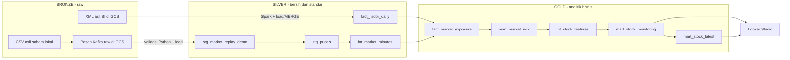

# Medallion Architecture — Bronze, Silver, Gold

Nama pola pengorganisasian data proyek ini adalah **Medallion Architecture**: data dipisahkan menurut tingkat pengolahannya, dari raw, menjadi bersih, lalu siap analisis. Pemetaan ini bersifat logis terhadap pipeline yang sudah berjalan; bukan tiga dataset baru dan bukan implementasi Delta Lake.

Diagram untuk presentasi: [bronze_silver_gold.svg](bronze_silver_gold.svg).

## Bronze — raw dan bukti sumber

Tujuan: menyimpan data asli agar dapat diaudit dan diproses ulang.

| Data | Lokasi nyata | Grain |
|---|---|---|
| XML JISDOR BI | GCS `gs://jcdeah-009-daud-finalproject/final-project/raw/jisdor/` | Satu respons API per run, berisi beberapa tanggal |
| CSV saham hasil yfinance | Lokal `data/market_universe/<source_run_id>/*_as_returned.csv` | Satu bar harga per saham/menit sumber |
| Pesan Kafka raw replay lengkap | GCS `final-project/demo/local-python/<run_id>/raw.jsonl` | Satu pesan dengan topic, partition, offset |
| Pesan Kafka raw demo per pesan | GCS `final-project/demo/incremental/<run_id>/raw/` | Satu objek per pesan |

XML/CSV asli tidak ditimpa untuk membuat tampilan bersih. File kandidat replay sudah merupakan hasil pemilihan kolom dan normalisasi waktu dari CSV, sehingga bukan salinan raw murni. Kafka adalah transport/log pesan, bukan nama layer penyimpanan tersendiri.

## Silver — bersih, tervalidasi, terstandar

Tujuan: menghasilkan data konsisten yang dapat digabungkan dan dihitung.

| Relasi/hasil | Lokasi | Proses |
|---|---|---|
| JISDOR processed | GCS `final-project/processed/jisdor/` | Spark: parsing tanggal, TRIM/UPPER USD, cast kurs, validasi, output per tanggal |
| `fact_jisdor_daily` | BigQuery `jcdeah-009.daud_finalproject` | MERGE; satu baris per `jisdor_date + currency` |
| Replay valid | GCS `final-project/demo/local-python/<run_id>/valid.jsonl` | Python: harga, schema, waktu, identitas dan mode tervalidasi |
| `stg_market_replay_demo` | BigQuery `jcdeah-009.daud_finalproject` | Staging tervalidasi; snapshot replay lengkap, sebelum deduplikasi dbt |
| `stg_prices` | BigQuery `jcdeah-009.daud_finalproject_demo` | Deduplikasi `event_id` |
| `int_market_minutes` | BigQuery `jcdeah-009.daud_finalproject_demo` | Satu saham/mode/tipe/menit; UTC, tanggal WIB, sesi New York |

Kurs invalid atau key batch duplikat menggagalkan publikasi. Harga asli dipertahankan; gap tidak diisi angka buatan. Nama `fact_jisdor_daily` tidak otomatis menjadikannya Gold: pada pemetaan ini perannya adalah sumber kurs bersih bagi analitik.

## Gold — analitik bisnis dan mart dashboard

Tujuan: menyediakan jawaban atas perubahan harga, nilai rupiah, sinyal, dan perbandingan saham.

Semua relasi berikut berada di BigQuery `jcdeah-009.daud_finalproject_demo`.

| Model | Peran |
|---|---|
| `fact_market_exposure` | Model analitik antara: join harga-kurs sesuai waktu, valuasi satu saham dalam IDR |
| `mart_market_risk` | Return, kontribusi harga/FX/interaksi, indikator pergerakan |
| `int_stock_features` | Model fitur antara: SMA3/SMA8 dan return sesi |
| `mart_stock_monitoring` | Mart utama: histori, sinyal simulasi, alasan, kualitas, dan pembanding |
| `mart_stock_latest` | Mart ringkasan: satu observasi sumber terbaru per saham/mode/tipe |

Grain mart monitoring: satu `symbol + ingestion_mode + record_type + minute_utc`.
Looker Studio membaca `mart_stock_monitoring` dan `mart_stock_latest`.

## Diagram hubungan

Diagram menyederhanakan orkestrasi dan transport; data processed GCS terdapat di antara Spark/Python dan warehouse.

## Posisi demo tambahan

- Tabel `daud_finalproject.demo_streaming_events` adalah staging tervalidasi demo per pesan. View bernama sama pada dataset demo melakukan deduplikasi per `demo_run_id + event_id`. Keduanya setara fungsi Silver, tetapi **bukan input mart Gold utama** saat ini.
- `demo_signal_scenarios` adalah fixture sintetis pengujian, bukan data pasar Bronze/Silver/Gold.
- `jisdor_date_coverage` adalah view audit tanggal, bukan dimensi bisnis baru.

## Kalimat untuk presentasi

"Proyek ini menggunakan pembagian logis Medallion Architecture. Bronze menyimpan sumber asli, Silver menstandarkan dan memvalidasi data, sedangkan Gold menggabungkan harga dan kurs menjadi mart untuk dashboard."

Medallion adalah **arsitektur lapisan pengolahan**, bukan nama skema relasional. Proyek ini memakai analytical marts dengan grain yang jelas; belum merupakan star schema lengkap karena belum memiliki tabel dimensi terpisah seperti `dim_stock` atau `dim_date`.
